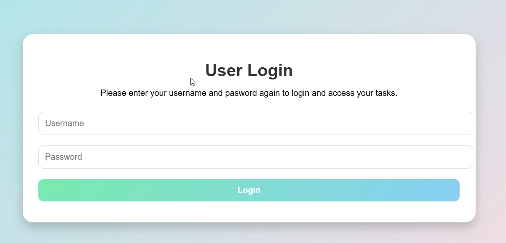
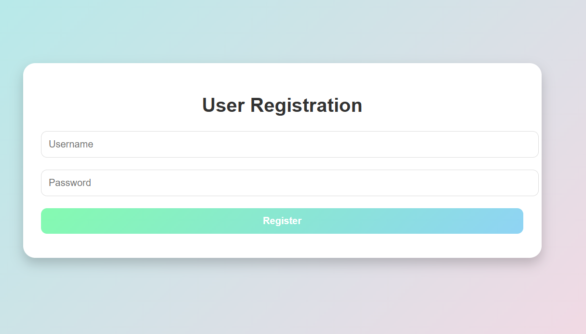
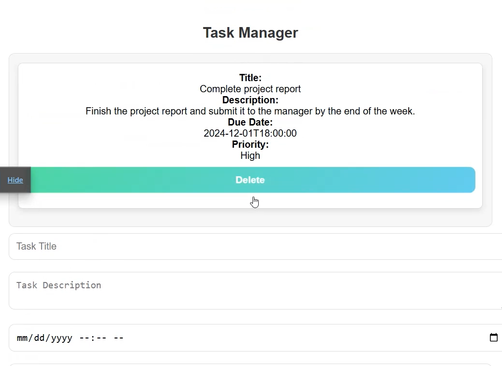
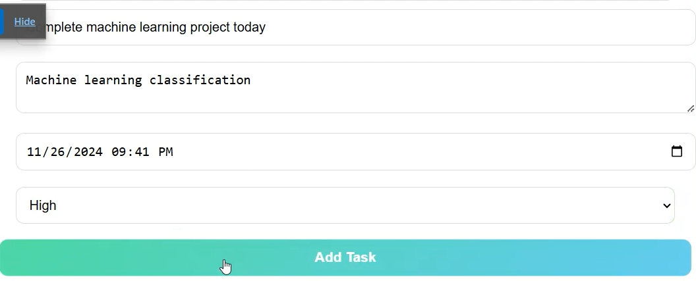
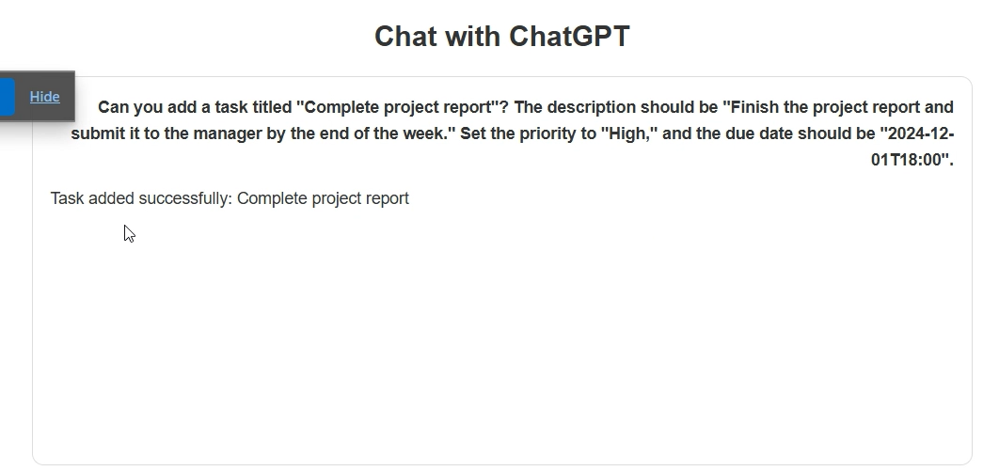
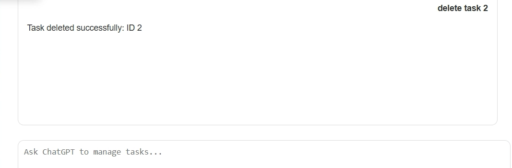

# Progressive-Web-Application-Task-Management

## Description
This repository contains the final project for **CMPE 280**. The project is a **Progressive Web Application (PWA)** for task management that enables users to efficiently create, manage, and track their tasks in various formats. By combining the responsiveness of modern web technologies with the capabilities of a native application, this PWA delivers a seamless and interactive user experience.

The application includes features such as task categorization, due date reminders, and progress tracking. It also integrates with external APIs to enhance functionality, such as providing suggestions for task prioritization.

---

## Features
- **Task Creation and Categorization**: Easily create tasks and organize them by category (e.g., work, personal, urgent).
- **Progress Tracking**: Visualize the progress of tasks using interactive charts and timelines.
- **Offline Support**: The PWA allows users to manage tasks even without an internet connection.
- **API Integration**: Connects with external services for additional features like AI-based task prioritization (requires an OpenAI key).
- **Responsive Design**: Optimized for use on both desktop and mobile devices.
- **Search and Filtering**: Quickly find tasks using robust search and filtering options.

---

## Project Structure
├── src/main/java/com/cmpe280/finalproject │ ├── CMPE280FinalProjectApplication.java # Main application entry point ├── src/main/resources │ ├── application.properties # Configuration file │ ├── static/ │ ├── index.html # Main HTML file │ ├── css/ # Styling files │ ├── js/ # JavaScript files │ ├── images/ # Assets and icons ├── README.md # Documentation

---

## Prerequisites
Before running this project, ensure the following are installed on your machine:
- **Java 8 or higher**
- **Maven**
- **Web Browser** (preferably Chrome or Firefox)
- **OpenAI API Key** (replace in `application.properties`)

---

## Setup Instructions
Follow these steps to set up and run the project:

**Clone the Repository**  
   Clone the repository to your local machine:
   ```bash
   git clone https://github.com/username/Progressive-Web-Application-Task-Management.git
   cd Progressive-Web-Application-Task-Management
   ```
**Update API Key**
Navigate to the src/main/resources directory and open the application.properties file. Replace OPEN_API_KEY with your valid OpenAI API key:
api.key=YOUR_OPENAI_API_KEY

**Build the Project**
Use Maven to build the project:

mvn clean install

## Run the Application
Execute the main application file:

java -jar target/CMPE280FinalProjectApplication.jar

## Launch the Frontend
Open the index.html file located in the src/main/resources/static folder in your preferred web browser. For example:

## Navigate to the static directory.
Double-click the index.html file to open it in your default browser.
Access the Application
Once the backend is running and the frontend is open in your browser, you can begin using the application.

## Contributors
- **Vivek Ponnala**
- **Venkat Gowtham Bhupalam**
- **Shashi Kumar Singarapu**
- **Aravind Reddy Kalluri**

---
## Working Application Features and Screenshots

### 1. Login Page


### 2. Register Page


### 3. Main Page


### 4. Adding a Task Manually, if you click delete, you can delete Task Manually


### 5. Adding a Task with ChatGPT


### 6. Deleting a Task with ChatGPT

